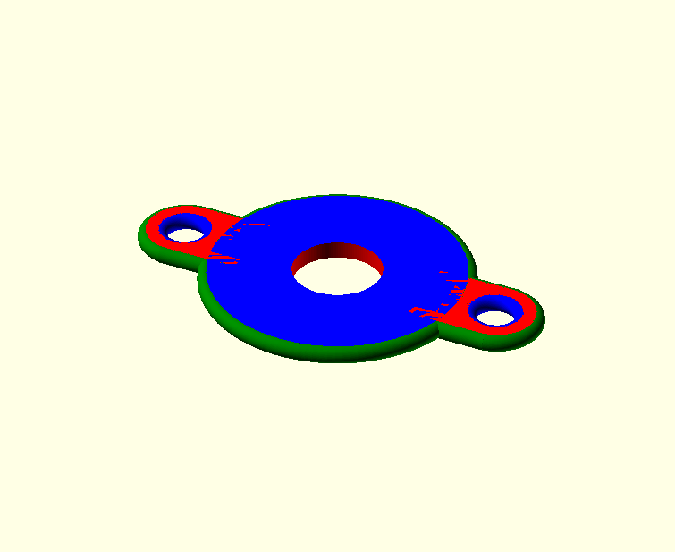
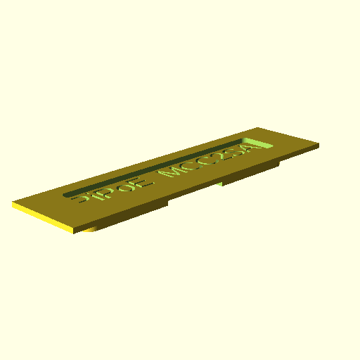

<!--- begin@of@TOC --->
# Table of contents

1. [design](#design)
     1. [design image](#design-image)
     1. [embedded view](#embedded-view)
1. [print](#print)
1. [repository](#repository)
1. [progress](#progress)
     1. [done](#done)
     1. [todo](#todo)
<!--- end@of@TOC --->
# design

`make design`

or

`openscad design.scad &`

## design image

`make image`

## embedded view

`make view`

# print

`make stl`

# repository

`git commit -am "DESIGN: COMMENT design"`

# progress

## done

- draw box that hiddes !
- smaller letter size, so it is visible (edges are not visible)

## todo

- add CI for GitHub and GitLab
- design version on hidden face
- design integrated LED holes (e.g. to see uSD access or Linux heartbeat)

